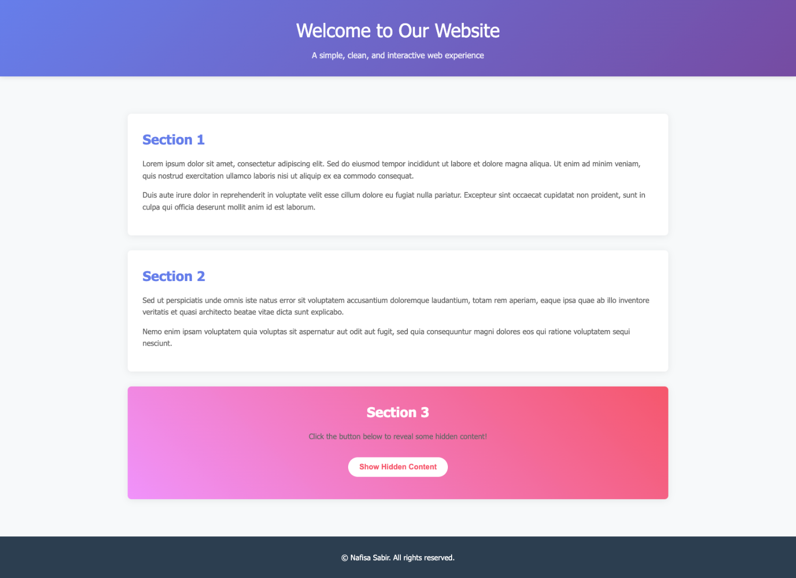

# 🌐 COMP 488 – Assignment 2: Deploy a Simple Website Using GitHub and Vercel



## 📖 Project Description

This project is a simple, clean, and interactive website created as part of **COMP 488 Assignment 2**.  
The website features:

- Three sections of text content
- A mobile-responsive design
- A button that reveals hidden content using JavaScript
- Deployment on Vercel with automatic redeployments on push

🔗 **Live Website:** [https://comp488-nsabir-assignemnt2.vercel.app/](https://comp488-nsabir-assignemnt2.vercel.app/)

## 🚀 How to Run Locally

1. **Clone the Repository**

```bash
   git clone https://github.com/mnafisa100/comp488-nsabir-assignemnt2.git
   cd comp488-nsabir-assignemnt2
```

2. **Open the Website**
   Just open `index.html` in your favorite web browser. No installation or server setup needed.

## 🛠️ Built With

- **HTML** – for structuring the content
- **CSS** – for styling and responsive design
- **JavaScript** – for the interactive button feature

## 💡 Reflection

Completing this assignment helped me understand the full lifecycle of a simple web project from development to deployment. I learned how to structure a website with HTML and style it in a way that looks clean and works well on both desktop and mobile devices. Adding a simple JavaScript feature reinforced how powerful small interactions can be for improving user experience.

I also gained hands-on experience with version control by making multiple commits and pushing my work to GitHub. Setting up Vercel for automatic deployment was particularly insightful, as it demonstrated how changes in my codebase can instantly reflect on a live site with minimal manual steps. Overall, this assignment gave me a practical understanding of a modern development workflow that I can apply to future projects.
